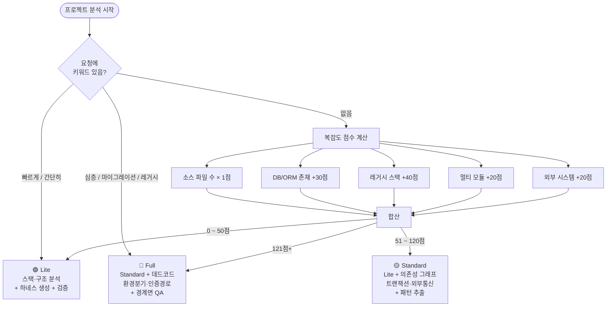
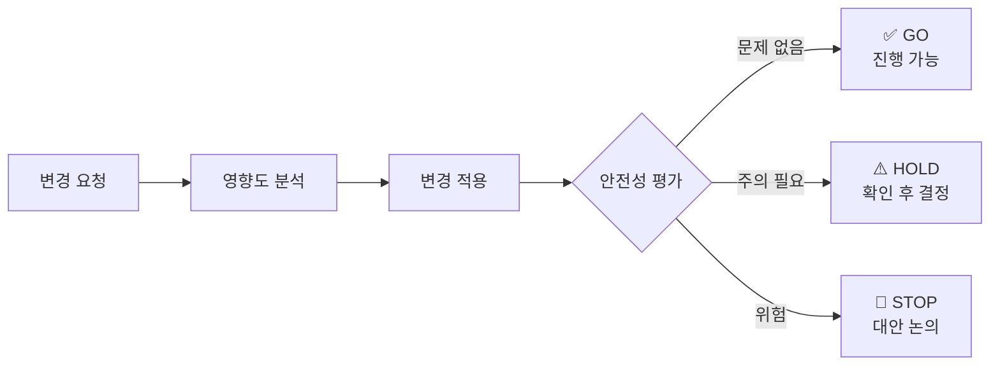

# harness-ito

> **ITO/SI 조직을 위한 Claude Code 확장 하네스**
>
> 처음 투입된 프로젝트에서 _"이 코드 뭐야?"_ 부터 _"이 변경 안전해?"_ 까지,
> Claude가 프로젝트를 이해하고 작업을 함께 수행할 수 있도록 돕는 에이전트 팀 + 워크플로우 도구 모음입니다.

---

## 🧬 설계 철학

검증된 오픈소스 방법론 3종을 SM 현장에 맞게 접목했습니다.

```
분석 전              분석 중              분석 후
─────────────────    ─────────────────    ─────────────────
목적이 명확한가?  →  파이프라인 실행   →  결과가 맞는가?
(Ouroboros)          (Superpowers)         (Karpathy)
```

| 출처 | 핵심 아이디어 | harness-ito 적용 |
|------|-------------|----------------|
| [Q00/ouroboros](https://github.com/Q00/ouroboros) | 코드 생성 전 모호성을 수치화해 80% 명확해질 때까지 질문 | **Phase -1 Spec Gate** — 목적·범위 확인 후 분석 시작 |
| [Andrej Karpathy](https://karpathy.bearblog.dev) | 출력을 스스로 평가 → 실패 원인 분석 → 재생성 (AutoResearch) | **Phase 4 Eval Loop** — 4차원 품질 채점 → 80점 미만 시 타겟 재생성 |
| [obra/superpowers](https://github.com/obra/superpowers) | 에이전트마다 프롬프트를 주지 말고 파이프라인에 방법론을 심어라 | **단계별 검증 파이프라인** — analyzer → writer → validator → qa → eval |

---

## 🤔 이게 왜 필요한가요?

Claude Code를 아무 설정 없이 사용하면 매번 _"이 프로젝트가 뭔지"_ 처음부터 설명해야 합니다.
harness-ito는 프로젝트를 **한 번 분석해 Claude가 기억할 수 있는 형태로 저장**합니다.

그 결과, 이후 작업에서 Claude는 다음을 알고 시작합니다:

- 🏗️ 이 프로젝트의 아키텍처와 레이어 구조
- 🔌 어떤 DB·외부 시스템과 연결되어 있는지
- 📐 코드 작성 컨벤션 (네이밍, 계층 패턴, 예외 처리 방식)
- 🕸️ 어떤 함수가 어떤 함수를 호출하는지 (호출 그래프)
- 🔒 트랜잭션 경계, 인증/인가 경로

이 정보를 바탕으로 영향도 분석, 안전 변경, 신규 기능 생성, 마이그레이션 계획 같은 작업을 **자연어로** 요청할 수 있게 됩니다.

---

## 📦 설치 방법

### 1단계 — 마켓플레이스 등록 (최초 1회)

Claude Code 어느 프로젝트에서나 실행:

```
/plugin marketplace add Malburi/harness-ito
```

### 2단계 — 플러그인 설치

```
/plugin install harness-ito@harness-ito
```

설치 확인:

```
/plugin list
```

`harness-ito@harness-ito — enabled` 가 보이면 됩니다. ✅

### 3단계 — Claude Code 재시작

플러그인은 재시작 후 적용됩니다.

> 💡 **설치가 안 될 때** — Claude Code 버전을 확인하세요. 플러그인 기능은 최신 버전에서 지원됩니다.

---

## 🚀 처음 시작하기 (하네스 초기화)

분석하고 싶은 **프로젝트 루트**에서 Claude Code를 열고 아래 중 하나를 입력하세요:

```
"하네스 초기화해줘"
"이 프로젝트 Claude 설정해줘"
"harness init"
```

`harness-init` 스킬이 자동으로 실행되어 아래 순서로 진행됩니다:


시작 전에 몇 가지 질문을 드릴 수 있습니다 (목적·범위·제약 확인). 바로 분석하고 싶으면 **"빠르게"** 를 붙여주세요.

완료되면 프로젝트 루트에 `CLAUDE.md`와 `.claude/` 폴더가 생깁니다.
이 파일들을 git에 커밋해 팀원과 공유하세요.

```bash
git add CLAUDE.md .claude/
git commit -m "docs: add project harness"
```

> ⏱️ **소요 시간:** Lite 1~2분 · Standard 3~5분 · Full 10분 내외

---

## ⚡ 분석 깊이 자동 조정 (3-Tier)

규모가 작은 프로젝트에 무거운 분석을 돌리는 건 낭비입니다.
harness-init은 시작 전에 복잡도를 빠르게 측정해서 분석 범위를 자동으로 맞춥니다.



| Tier | 점수 | 적합한 프로젝트 | 소요 시간 |
|------|------|--------------|---------|
| 🟢 **Lite** | ~50점 | 소규모 단일 모듈, 사이드 프로젝트 | 1~2분 |
| 🟡 **Standard** | 51~120점 | 일반적인 웹 서비스, Spring Boot + DB | 3~5분 |
| 🔴 **Full** | 121점+ | 대형 레거시, 마이그레이션 대상 | ~10분 |

---

## 💬 하네스 초기화 이후 — 일상 작업에서 쓰는 법

하네스가 설치된 프로젝트에서는 자연어로 아래 작업을 요청할 수 있습니다.

### 🔍 코드 이해

```
"주문 취소 로직 어떻게 돼?"
```
→ `trace-logic` → 진입점 · Controller · Service · Repository · DB 쿼리까지 전체 흐름 리포트

```
"결제 관련 코드 어디 있어?"
```
→ `find-feature` → 관련 파일 · 클래스 · 메서드 · SQL ID 목록

```
"이 PL/SQL 뭐하는 코드야?"
```
→ `legacy-decoder` → 비즈니스 의도 역공학 리포트

---

### 🛡️ 변경 전 확인

```
"OrderService.cancel 수정하면 어디 영향가?"
```
→ `analyze-impact` → 직접 호출자, 트랜잭션 경계, 관련 테스트, 화면 영향 정리

```
"이 변경 안전하게 적용해줘"
```
→ `safe-modify` → 영향 분석 → 적용 → 안전성 판정



> HOLD / STOP 이 나오면 Claude가 이유와 권고 조치를 함께 알려줍니다. **자동 수정은 하지 않습니다.**

---

### 🏗️ 신규 기능 개발

```
"환불 기능을 프로젝트 컨벤션에 맞게 만들어줘"
```
→ `scaffold-feature` → 기존 패턴 분석 → Controller · Service · Repository · DTO · 테스트 골격 일괄 생성

---

### 🗄️ SQL 리뷰

```
"이 쿼리 문제없어? SELECT * FROM orders WHERE ..."
```
→ `review-sql` → 사용처 · 인덱스 활용 · N+1 위험 · SQL 인젝션 · DDL 영향 종합 리포트

---

### 🚚 마이그레이션

```
"Spring Boot 3으로 마이그레이션 계획 짜줘"
"Oracle에서 PostgreSQL로 전환 계획 짜줘"
```
→ `plan-migration` → 인벤토리 → 매핑 테이블 → 단계별 계획 → 리스크 레지스터 → 롤백 플랜

---

### 📝 문서 동기화

```
"코드 바꿨는데 문서 동기화해줘"
```
→ `doc-syncer` → CLAUDE.md · README · API 문서 업데이트 권고 목록

---

## 🏭 운영 환경 키워드

변경 작업 요청 시 상황을 알려주면 Claude가 안전성 판단 기준을 맞춰줍니다:

| 상황 | 키워드 예시 |
|------|-----------|
| 🏢 운영 서버 반영 | "운영 패치야", "프로덕션 배포 전이야" |
| 🚨 긴급 수정 | "긴급 핫픽스야" — 변경 범위를 작게 제한 |
| 🏚️ 레거시 코드 | "레거시 손보는 거야" — 컨벤션 기준 완화 |
| 🎯 고객 데모 직전 | "고객 데모 직전이야" — 외부 영향 가중치 높임 |
| 🌙 야간 배치 | "야간 배치 관련이야" |

---

## 📁 하네스가 만드는 파일들

초기화 후 프로젝트에 생기는 파일 구조입니다:

```
프로젝트/
├── CLAUDE.md                          ← 🧠 이 프로젝트의 핵심 가이드 (git 커밋 권장)
└── .claude/
    ├── ito-guide.md                   ← 📖 하네스 사용 설명서 (초기화 시 자동 생성)
    ├── skills/                        ← ⚙️ 워크플로우 스킬 (git 커밋 권장)
    │   ├── analyze-impact.md
    │   ├── safe-modify.md
    │   ├── scaffold-feature.md
    │   ├── plan-migration.md          ← 마이그레이션 필요 시에만 생성
    │   └── review-sql.md              ← DB 사용 시에만 생성
    ├── agents/
    │   └── domain-expert.md           ← 🎓 이 프로젝트의 도메인 지식
    └── patterns/                      ← 📐 코드 컨벤션 패턴
        ├── controller_pattern.md
        ├── service_pattern.md
        ├── dao_pattern.md
        ├── client_pattern.md          ← Legacy Static JS 탐지 시에만 생성
        └── ...

_workspace/                            ← 🔧 분석 산출물 (.gitignore 권장)
├── 00_spec_report.md                  ← 명세 명확화 리포트 (Phase -1)
├── 01_analyzer_report.md              ← 분석 리포트
├── 06_eval_report.md                  ← 품질 Eval 결과 (Phase 4)
├── index/                             ← ⚡ JSON 인덱스 (후속 작업 고속화)
│   ├── call_graph.json                ← 함수 호출 그래프
│   ├── symbols.json                   ← 클래스·메서드 위치 인덱스
│   ├── sql_usage.json                 ← SQL ID ↔ 호출 위치
│   ├── transactions.json              ← 트랜잭션 경계
│   ├── external_io.json               ← 외부 시스템 연결
│   ├── client_index.json              ← JS↔JSP 매핑 (Legacy Static JS 탐지 시)
│   └── ...
└── impact_<slug>.md                   ← 영향도 분석 결과 (작업별 생성)
```

> 💡 `CLAUDE.md`와 `.claude/`는 팀원과 공유하기 위해 git에 커밋하세요.
> `_workspace/`는 런타임 산출물이므로 `.gitignore`에 추가를 권장합니다.

---

## 🌐 지원 스택

ITO/SI 현장에서 자주 만나는 레거시를 포함해 자동으로 탐지합니다.

| 카테고리 | 지원 스택 |
|---------|----------|
| ☕ Java EE 레거시 | Struts 1.x/2.x, Spring 3~4, iBatis, EJB 2, JSP/JSTL |
| 🍃 Spring | Spring Boot 2/3, Spring MVC, MyBatis, Spring Data JPA, Spring Security |
| 🏛️ 전자정부 | egovframework |
| 🟩 Node.js | Express, NestJS, Next.js, Fastify, Koa |
| 🖥️ 프런트엔드 | Vue 2/3, Nuxt 2/3, Pinia/Vuex, React, Angular 15+, AngularJS 1.x, Svelte |
| 📜 Legacy Static JS | jQuery 1.x~3.x, 빌드 도구 없는 JSP+JS 혼합 (JS↔JSP 매핑, onInit/onSaveData 규약, eval AJAX 자동 추출) |
| 🐍 Python | FastAPI, Django, Flask |
| 🔷 .NET | .NET Framework 2~4, .NET Core, .NET 5~8, ASP.NET Core |
| 🗄️ DB | Oracle, PostgreSQL, MySQL/MariaDB, Tibero, Altibase, SQL Server |
| 🔄 마이그레이션 경로 | Struts→Spring, iBatis→MyBatis/JPA, Vue 2→3, Vuex→Pinia, Oracle→PostgreSQL 등 |

---

## ❓ 자주 묻는 질문

**Q. 초기화할 때 질문이 너무 많아요. 바로 시작하고 싶어요.**

"빠르게 하네스 초기화해줘" 처럼 **"빠르게"** 를 붙이거나 "skip spec"을 포함하면 질문 없이 바로 분석으로 넘어갑니다.

**Q. 품질 점수(Eval)가 낮으면 어떻게 되나요?**

80점 미만이면 낮은 차원(커버리지·정확도·실행가능성·컨텍스트 품질)만 골라 자동으로 재생성합니다. 전체 재실행이 아닌 **타겟 재생성**이라 시간이 크게 늘지 않습니다. 재생성 후 점수가 오히려 낮아지면 초기 결과를 유지합니다.

**Q. harness를 완전히 제거하고 싶어요.**

```
"하네스 삭제해줘"
"harness clean"
```

→ `harness-clean` 스킬이 삭제 대상 목록을 먼저 보여주고 확인을 받습니다. 자동 삭제 없음.  
플러그인 자체를 제거하려면 확인 후 안내해 드립니다:

```
/plugin uninstall harness-ito
```

**Q. 하네스를 한 번 만들면 코드가 바뀌었을 때는?**

인덱스를 증분 갱신할 수 있습니다:
```
"인덱스 갱신해줘"
```
큰 변경이 있었다면 `"하네스 다시 초기화해줘"` 로 전체 재실행도 가능합니다.

**Q. 초기화 후 어떻게 쓰는지 모르겠어요.**

초기화가 끝나면 `.claude/ito-guide.md` 파일이 자동으로 생성됩니다.
이 파일에는 이 프로젝트에 맞는 스킬 트리거 예시, 실전 시나리오, 주의사항이 담겨 있습니다.

```
"ito-guide 보여줘"
```

**Q. 특정 부분만 다시 만들고 싶어요.**

```
"스킬만 다시 생성해줘"
"패턴만 다시 추출해줘"
"validator만 다시 실행해줘"
```

**Q. _workspace/ 폴더가 너무 커요.**

분석이 끝난 후 `_workspace/`는 지워도 됩니다. 단, `_workspace/index/`는 영향도 분석·안전 변경 등에서 참조하므로 남겨두는 편이 좋습니다.

**Q. ✅ GO / ⚠️ HOLD / 🛑 STOP 이 나왔는데 어떻게 해야 하나요?**

- ✅ **GO** — 진행해도 안전합니다.
- ⚠️ **HOLD** — 주의가 필요한 부분이 있습니다. Claude가 상세 내용을 알려줍니다. 확인 후 결정하세요.
- 🛑 **STOP** — 현재 방식으로는 진행하지 않는 것을 권고합니다. 대안을 논의하세요.

Claude는 HOLD/STOP 상황에서도 자동 수정을 하지 않습니다. **판단은 항상 사람이 합니다.**

---

## 📚 에이전트 & 스킬 전체 목록

<details>
<summary>펼쳐보기</summary>

### ⚙️ 워크플로우 스킬 (10종)

| 스킬 | 트리거 예시 | 역할 |
|------|-----------|------|
| `spec-gate` | "작업 전 범위 정해줘" | 소크라테스식 명세 명확화 (단독 실행 가능) |
| `harness-init` | "하네스 초기화해줘" | 명세 확인 → 분석 → 생성 → 검증 → eval 오케스트레이터 |
| `harness-clean` | "하네스 삭제해줘" | 생성된 harness 파일 전체 안전 제거 |
| `analyze-impact` | "영향도 분석해줘" | 변경 영향 범위 분석 |
| `safe-modify` | "안전하게 적용해줘" | 영향 분석 + 적용 + 안전성 판정 |
| `scaffold-feature` | "컨벤션 따라 만들어줘" | 전 레이어 신규 기능 생성 |
| `plan-migration` | "마이그레이션 계획 짜줘" | 스택 전환 계획 수립 |
| `review-sql` | "SQL 점검해줘" | SQL 종합 리뷰 |
| `trace-logic` | "로직 어떻게 돼?" | 처리 흐름 추적 |
| `find-feature` | "어디 있어?" | 기능·키워드로 코드 위치 탐색 |

### 🤖 에이전트 (16종)

| 에이전트 | 역할 | 모델 |
|---------|------|------|
| `spec-clarifier` | 소크라테스 인터뷰 + 모호성 점수 + 명세 리포트 (Phase -1) | sonnet |
| `analyzer` | 코드베이스 분석 + 인덱스 생성 | opus (Full) / sonnet (Lite·Standard) |
| `writer` | 하네스 파일 생성 | opus (Full) / sonnet (Lite·Standard) |
| `pattern-extractor` | 코드 컨벤션 패턴 추출 (Legacy Static JS 포함) | sonnet |
| `validator` | 하네스 구조 검증 | sonnet |
| `qa` | 경계면 교차 비교 (Full만) | sonnet |
| `harness-evaluator` | 4차원 품질 평가 + 타겟 재생성 지시 (Phase 4) | sonnet |
| `impact-analyzer` | 변경 영향도 분석 | opus |
| `change-safety` | 안전성 평가 (GO/HOLD/STOP) | sonnet |
| `migration-planner` | 마이그레이션 계획 수립 | opus |
| `test-generator` | 회귀 테스트 골격 생성 | sonnet |
| `sql-reviewer` | SQL 다각도 리뷰 | sonnet |
| `legacy-decoder` | 레거시 코드 역공학 | opus |
| `doc-syncer` | 코드 ↔ 문서 동기화 점검 | sonnet |
| `logic-tracer` | 처리 흐름 추적 | sonnet |
| `feature-finder` | 기능·키워드 코드 위치 탐색 | sonnet |

</details>

---

## 🔗 참고

- [Malburi/harness-new](https://github.com/Malburi/harness-new) — 기반 4-에이전트 파이프라인
- [revfactory/harness](https://github.com/revfactory/harness) — 메타 하네스 설계 원칙
- [Claude Code 공식 문서](https://docs.anthropic.com/en/docs/claude-code/overview)
- [`docs/user-guide.md`](docs/user-guide.md) — 사용자 설명서 (스킬별 사용법 + SM 실무 시나리오)
- [`docs/workflows.md`](docs/workflows.md) — 스킬별 상세 시나리오
- [`docs/stack-matrix.md`](docs/stack-matrix.md) — 지원 스택 상세 매트릭스
