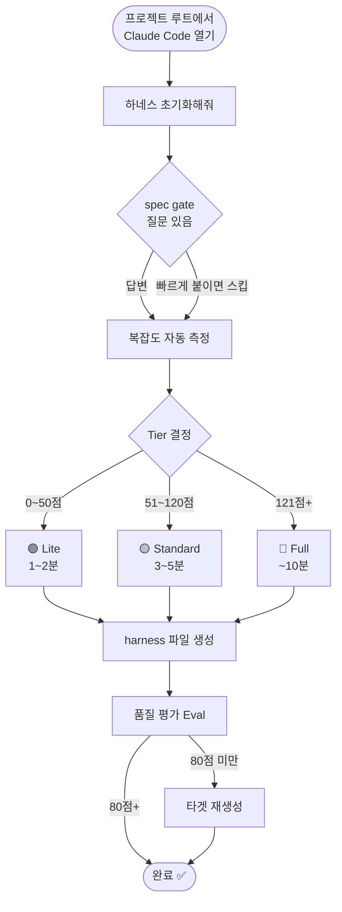
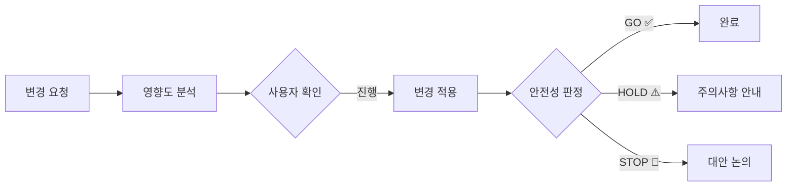

# harness-ito 사용자 설명서

> SM/SI 현장 실무자를 위한 단계별 가이드

---

## 목차

1. [빠른 시작](#1-빠른-시작)
2. [설치](#2-설치)
3. [첫 번째 harness 만들기](#3-첫-번째-harness-만들기)
4. [스킬별 사용법](#4-스킬별-사용법)
5. [SM 실무 시나리오](#5-sm-실무-시나리오)
6. [출력 파일 설명](#6-출력-파일-설명)
7. [팁 & 주의사항](#7-팁--주의사항)

---

## 1. 빠른 시작

### 처음 투입된 프로젝트라면?

```
"하네스 초기화해줘"
```

하나만 기억하면 됩니다. 나머지는 harness-ito가 알아서 합니다.

### 지금 당장 뭔가 해야 한다면?

| 상황 | 입력 |
|------|------|
| 이 코드가 뭔지 모르겠다 | `"주문 취소 로직 어떻게 돼?"` |
| 수정해도 되는지 모르겠다 | `"이거 바꾸면 어디 영향가?"` |
| 빠르게 안전하게 고쳐야 한다 | `"이 변경 안전하게 적용해줘"` |
| SQL이 맞는지 모르겠다 | `"이 쿼리 점검해줘"` |
| 다 지우고 싶다 | `"하네스 삭제해줘"` |

---

## 2. 설치

### 2-1. 플러그인 등록 (최초 1회)

Claude Code 어느 프로젝트에서나 실행:

```
/plugin marketplace add Malburi/harness-ito
/plugin install harness-ito@harness-ito
```

설치 확인:

```
/plugin list
```

`harness-ito@harness-ito — enabled` 가 보이면 완료.

### 2-2. Claude Code 재시작

플러그인은 재시작 후 적용됩니다.

---

## 3. 첫 번째 harness 만들기

### 전체 흐름



### Step 1 — 프로젝트 루트에서 시작

Claude Code를 분석하고 싶은 프로젝트 폴더에서 엽니다.

```bash
cd /your/project/root
claude
```

### Step 2 — 초기화 요청

```
"하네스 초기화해줘"
```

> **빠르게 하고 싶다면:** `"빠르게 하네스 초기화해줘"` — 질문 없이 바로 분석

### Step 3 — 목적 질문에 답변 (Spec Gate)

초기화 전에 몇 가지 질문이 나옵니다:

```
harness 초기화 전에 몇 가지 확인이 필요합니다:

1. [범위] 전체 프로젝트인가요, 특정 모듈인가요?
2. [목표] 주로 어떤 작업을 하실 예정인가요?
   (코드 이해 / 버그 수정 / 신규 기능 / 마이그레이션)
3. [제약] 분석 시 제외할 영역이 있나요?
```

**답변 예시:**

| 답변 | 결과 |
|------|------|
| `"전체, 버그 수정이요"` | Standard Tier로 분석 |
| `"주문 모듈만요, 마이그레이션 준비"` | Full Tier 권고 |
| `"스킵"` | 전체를 자동 탐지로 진행 |

### Step 4 — 완료 확인

```
하네스 초기화 완료 [Tier: Standard | 점수: 87점]

생성된 파일:
  CLAUDE.md
  .claude/skills/analyze-impact.md
  .claude/skills/safe-modify.md
  ...

Eval 품질 점수: 91/100 ✅
```

생성된 파일을 git에 커밋해 팀원과 공유하세요:

```bash
git add CLAUDE.md .claude/
git commit -m "docs: add project harness"
```

---

## 4. 스킬별 사용법

### 4-1. `spec-gate` — 작업 전 범위 정리

> 큰 작업을 시작하기 전에 목적과 범위를 명확히 합니다.

**언제 쓰나요?**
- 신규 투입 후 첫 작업 전
- 마이그레이션 계획 수립 전
- 대형 기능 개발 전

**사용 예시:**

```
"작업 범위 정해줘"
"시작 전 요구사항 정리해줘"
"spec gate"
```

**출력:**

```
명세 명확화 완료 (모호성 점수: 0.15)

목표: 마이그레이션
범위: 주문·결제 모듈
주요 제약: 운영 DB 접속 불가
권고 Tier: Full
```

---

### 4-2. `harness-init` — harness 초기화

> 프로젝트 전체를 분석해 Claude 전용 가이드 파일을 생성합니다.

**Tier별 차이:**

| | 🟢 Lite | 🟡 Standard | 🔴 Full |
|-|---------|------------|--------|
| 소요 시간 | 1~2분 | 3~5분 | ~10분 |
| 스택·구조 분석 | ✅ | ✅ | ✅ |
| 의존성 그래프 | ❌ | ✅ | ✅ |
| 트랜잭션 경계 | ❌ | ✅ (DB 있을 때) | ✅ |
| 데드코드 탐지 | ❌ | ❌ | ✅ |
| 경계면 QA | ❌ | ❌ | ✅ |
| 권장 상황 | 사이드 프로젝트, 빠른 파악 | 일반 SM | 레거시, 마이그레이션 |

**강제 Tier 지정:**

```
"빠르게 하네스 초기화해줘"        → Lite 강제
"심층 분석해서 하네스 만들어줘"    → Full 강제
"레거시 분석해줘"                  → Full 강제
```

---

### 4-3. `analyze-impact` — 변경 영향도 분석

> 수정하기 전에 "이거 바꾸면 어디까지 영향가는지" 먼저 확인합니다.

**사용 예시:**

```
"OrderService.cancel 수정하면 어디 영향가?"
"TBL_ORDER에 STATUS 컬럼 추가하면?"
"이 API 응답 형식 바꾸려는데 영향도 분석해줘"
```

**출력 형식:**

```
영향도 분석 결과 — OrderService.cancel

위험도: 🟡 MEDIUM (6/10)

직접 영향 (3건):
  - OrderController.cancelOrder() → 직접 호출
  - BatchOrderService.cancelExpired() → 직접 호출
  - OrderEventListener.onCancel() → 이벤트 구독

간접 영향 (5건):
  - 재고 반환 로직 (InventoryService)
  - 결제 취소 연동 (PaymentGateway)
  - 알림 발송 (NotificationService)
  - 주문 이력 기록
  - 쿠폰 복원 처리

영향받는 테스트:
  - OrderServiceTest.testCancel()
  - BatchOrderServiceTest.testCancelExpired()

외부 시스템 영향:
  - PG사 결제 취소 API 호출 포함 → 운영 테스트 필요
```

---

### 4-4. `safe-modify` — 안전 변경

> 영향 분석 → 수정 → 안전성 판정까지 한 번에 진행합니다.



**판정 기준:**

| 판정 | 의미 | 예시 상황 |
|------|------|---------|
| ✅ **GO** | 진행해도 안전 | 단순 버그 수정, 영향 범위 명확 |
| ⚠️ **HOLD** | 주의 후 진행 | 트랜잭션 경계 변경, 외부 시스템 연동 |
| 🛑 **STOP** | 현재 방식 중단 | 운영 DB 직접 수정, 인증 우회 위험 |

> Claude는 HOLD/STOP 상황에서도 **자동 수정하지 않습니다.** 판단은 항상 사람이 합니다.

---

### 4-5. `scaffold-feature` — 신규 기능 생성

> 프로젝트의 코딩 컨벤션을 자동으로 읽어서 맞는 형식으로 파일을 생성합니다.

**사용 예시:**

```
"환불 기능을 프로젝트 컨벤션에 맞게 만들어줘"
"쿠폰 적용 API 새로 만들어줘"
```

**생성되는 파일 예시 (Spring Boot 기준):**

```
생성 파일 목록:

  src/main/java/.../controller/RefundController.java
  src/main/java/.../service/RefundService.java
  src/main/java/.../service/impl/RefundServiceImpl.java
  src/main/java/.../mapper/RefundMapper.java
  src/main/resources/mapper/RefundMapper.xml
  src/test/java/.../service/RefundServiceTest.java
```

> `scaffold-feature`는 기존 코드에서 패턴을 읽어 생성합니다.
> 패턴이 없으면 먼저 `"패턴 추출해줘"`를 실행하세요.

---

### 4-6. `plan-migration` — 마이그레이션 계획

> 스택 전환 계획을 단계별로 수립합니다.

**지원 마이그레이션 경로:**

| 소스 | 타겟 |
|------|------|
| Struts 1.x / 2.x | Spring Boot |
| iBatis | MyBatis / JPA |
| Vue 2 + Vuex | Vue 3 + Pinia |
| Nuxt 2 | Nuxt 3 |
| .NET Framework | .NET 6+ |
| Oracle | PostgreSQL |
| Spring 3/4 | Spring Boot 3 |

**출력 파일:**

```
_workspace/migration/
  00_inventory.md        ← 전환 대상 전체 목록
  01_mapping_table.md    ← AS-IS / TO-BE 매핑
  02_phased_plan.md      ← 단계별 실행 계획
  03_risk_register.md    ← 리스크 목록 + 대응 방안
  04_test_strategy.md    ← 테스트 전략
  05_rollback_plan.md    ← 롤백 시나리오
```

---

### 4-7. `review-sql` — SQL 리뷰

> SQL 쿼리의 성능·보안·영향도를 종합 점검합니다.

**사용 예시:**

```
"이 쿼리 문제없어?
 SELECT * FROM TBL_ORDER WHERE USER_ID = #{userId}"

"이 인덱스 제대로 타고 있어?"
"N+1 문제 있어?"
```

**점검 항목:**

| 항목 | 내용 |
|------|------|
| 사용처 추적 | 어느 Service/Mapper에서 호출하는지 |
| 인덱스 활용 | WHERE 조건이 인덱스를 제대로 타는지 |
| N+1 패턴 | 루프 안에서 반복 호출되는지 |
| SQL 인젝션 | `${}` 직접 치환 사용 여부 |
| 트랜잭션 | 해당 쿼리가 트랜잭션 안에 있는지 |
| DDL 영향 | 테이블 변경 시 연관 쿼리 영향 |

---

### 4-8. `trace-logic` — 처리 흐름 추적

> "이 기능이 어떻게 동작하는지" 진입점부터 DB까지 추적합니다.

**사용 예시:**

```
"주문 취소 로직 전체 흐름 보여줘"
"로그인 처리 어떻게 돼?"
"/api/orders POST 어디로 가?"
```

**출력 형식:**

```
주문 취소 처리 흐름

① 진입점
   POST /api/orders/{id}/cancel
   → OrderController.cancelOrder()

② Service
   → OrderService.cancel(orderId, reason)
   → @Transactional 시작
   → 주문 상태 검증 (ORDERED, PAID만 가능)

③ 외부 연동
   → PaymentService.refund()        ← PG사 환불 API 호출
   → InventoryService.restore()     ← 재고 복원

④ DB
   UPDATE TBL_ORDER SET STATUS = 'CANCELLED'
   INSERT INTO TBL_ORDER_HISTORY
   UPDATE TBL_INVENTORY SET STOCK = STOCK + #{qty}

⑤ 이벤트
   → OrderCancelledEvent 발행
   → NotificationService (비동기)
```

---

### 4-9. `find-feature` — 코드 위치 탐색

> 기능명이나 키워드로 관련 코드를 빠르게 찾습니다.

**사용 예시:**

```
"결제 관련 코드 어디 있어?"
"쿠폰 할인 로직 찾아줘"
"SMS 발송 어디서 해?"
```

**출력 형식:**

```
"결제" 관련 코드 위치

Controller:
  - PaymentController.java (line 45, 89, 123)
  - OrderController.java (line 201) ← 결제 요청 포함

Service:
  - PaymentService.java (전체)
  - OrderService.java (line 156) ← 결제 상태 확인

SQL:
  - PaymentMapper.xml (쿼리 ID: selectPayment, insertPayment)
  - OrderMapper.xml (line 234) ← 결제 금액 조회

외부 연동:
  - PgGateway.java ← PG사 API 직접 호출
```

---

### 4-10. `harness-clean` — harness 제거

> 설치된 harness 파일 전체를 안전하게 제거합니다.

**사용 예시:**

```
"하네스 삭제해줘"
"harness clean"
"초기화 되돌려줘"
```

**제거 과정:**

```
다음 파일을 삭제합니다:

[harness 파일]
  ✓ .claude/skills/ (9개 파일)
  ✓ .claude/agents/domain-expert.md
  ✓ .claude/patterns/ (6개 파일)

[분석 산출물]
  ✓ _workspace/ (34개 파일)

[별도 확인]
  ? CLAUDE.md — 함께 삭제할까요?

계속하려면 "삭제" / 전체 삭제는 "전체 삭제" / 취소는 다른 내용 입력
```

플러그인 자체 제거:

```
/plugin uninstall harness-ito
```

---

## 5. SM 실무 시나리오

### 시나리오 1 — 신규 투입 첫날

> "오늘 투입됐는데 이 시스템이 뭔지 모르겠다."


**추천 순서:**

```
1. "하네스 초기화해줘"
   → CLAUDE.md + 전체 구조 파악

2. "결제 흐름 보여줘"
   → trace-logic으로 핵심 업무 흐름 파악

3. "이 클래스 뭐하는 거야? [코드 붙여넣기]"
   → legacy-decoder로 레거시 코드 해석
```

**소요 시간:** harness 초기화 5~10분 → 업무 파악 1~2시간 (기존 반나절~하루)

---

### 시나리오 2 — 긴급 장애 대응

> "운영 장애다. 빠르게 원인 찾아야 한다."

```
"주문 취소 오류 나고 있어. 관련 로직 추적해줘"
→ trace-logic: 오류 발생 경로 즉시 추적

"이 에러 로그 분석해줘: [로그 붙여넣기]"
→ 에러 위치 + 호출 스택 역추적

"핫픽스 적용해야 해. 이 변경 안전해?"
→ safe-modify: 영향 범위 확인 후 HOLD/GO 판정
```

> ⚡ 장애 상황에서는 `analyze-impact`를 먼저 실행하고 영향 범위를 확인한 후 수정하세요.

---

### 시나리오 3 — 변경 요청 처리

> "고객사에서 주문 상태에 컬럼 하나 추가해달라고 한다."

```
1. "TBL_ORDER에 CANCEL_REASON 컬럼 추가하면 영향도 분석해줘"
   → 연관 쿼리, DTO, 화면 영향 전체 파악

2. "이 변경 안전하게 적용해줘"
   → safe-modify: 단계별 적용 + 사후 검증

3. "이 SQL 리뷰해줘: [변경된 쿼리]"
   → review-sql: 인덱스, 트랜잭션 적정성 확인
```

**변경 전후 비교:**

| | 기존 방식 | harness-ito |
|-|---------|------------|
| 영향 범위 파악 | 코드 전체 수동 grep | analyze-impact 자동 분석 |
| 변경 안전성 | 경험에 의존 | GO/HOLD/STOP 판정 |
| 소요 시간 | 2~4시간 | 15~30분 |

---

### 시나리오 4 — 담당자 교체 / 인수인계

> "다음 주에 담당자가 바뀐다."

```
1. "하네스 초기화해줘" (아직 없다면)
   → CLAUDE.md = 자동 시스템 개요서

2. git add CLAUDE.md .claude/ && git commit
   → harness 파일을 git에 올려 팀 공유

3. 신규 담당자: Claude Code 설치 후 프로젝트 열면
   → CLAUDE.md 자동 로드 → 맥락 그대로 인계
```

> 💡 harness가 있으면 신규 담당자가 `"주문 취소 흐름 보여줘"` 한 줄로 바로 시작할 수 있습니다.

---

### 시나리오 5 — 마이그레이션 준비

> "Struts로 된 이 시스템을 Spring Boot로 전환해야 한다."

```
1. "심층 분석해서 하네스 만들어줘"   → Full Tier 분석

2. "Spring Boot로 마이그레이션 계획 짜줘"
   → plan-migration: 인벤토리 → 매핑 → 단계별 계획 → 리스크

3. "이 Struts Action 클래스 뭐하는 거야?"
   → legacy-decoder: 레거시 비즈니스 로직 역공학

4. "문서 동기화해줘"
   → doc-syncer: 코드 변경 후 CLAUDE.md 최신화
```

---

## 6. 출력 파일 설명

### CLAUDE.md — 핵심 가이드

harness-init이 생성하는 프로젝트 전용 가이드. Claude가 매 대화마다 자동으로 읽습니다.

```markdown
# CLAUDE.md 포함 내용

## 기술 스택        ← 언어, 프레임워크, DB
## 요청 흐름        ← Controller → Service → DAO → DB 경로
## 주요 파일 위치   ← 레이어별 실제 경로
## 빌드 / 실행      ← 빌드·실행 명령어
## 자동 워크플로우  ← 어떤 상황에 어떤 스킬 사용
## 작업 시 주의사항 ← 레거시 특이사항, 금지 패턴
## 변경 이력        ← harness 변경 기록
```

**관리 방법:** git에 커밋해 팀원과 공유. 코드가 크게 바뀌면 `"하네스 업데이트해줘"`.

---

### `_workspace/` — 분석 산출물

| 파일 | 내용 | 삭제 가능? |
|------|------|---------|
| `00_spec_report.md` | 명세 명확화 결과 | ✅ |
| `01_analyzer_report.md` | 전체 분석 리포트 | ⚠️ (참조용) |
| `02_writer_files.md` | 생성 파일 목록 | ✅ |
| `03_validator_report.md` | 구조 검증 결과 | ✅ |
| `04_qa_report.md` | 경계면 QA 결과 | ✅ |
| `06_eval_report.md` | 품질 평가 결과 | ✅ |
| `index/call_graph.json` | 함수 호출 그래프 | ❌ (영향도 분석에 사용) |
| `index/symbols.json` | 클래스·메서드 위치 | ❌ |
| `index/transactions.json` | 트랜잭션 경계 | ❌ |
| `index/external_io.json` | 외부 시스템 연결 | ❌ |
| `impact_<slug>.md` | 영향도 분석 결과 | ✅ |

> `_workspace/index/` 는 영향도 분석·안전 변경 속도에 영향을 주므로 남겨두는 것을 권장합니다.

---

### `.claude/` — harness 파일

| 경로 | 내용 | git 커밋? |
|------|------|---------|
| `skills/analyze-impact.md` | 영향도 분석 트리거 | ✅ 권장 |
| `skills/safe-modify.md` | 안전 변경 트리거 | ✅ 권장 |
| `skills/scaffold-feature.md` | 신규 기능 생성 트리거 | ✅ 권장 |
| `skills/plan-migration.md` | 마이그레이션 트리거 | ✅ 권장 |
| `skills/review-sql.md` | SQL 리뷰 트리거 | ✅ 권장 |
| `agents/domain-expert.md` | 도메인 지식 주입 | ✅ 권장 |
| `patterns/*.md` | 코딩 컨벤션 패턴 | ✅ 권장 |
| `backup/` | 재초기화 전 백업 | ❌ gitignore 권장 |

---

## 7. 팁 & 주의사항

### 자주 쓰는 조합

```
# 변경 작업 표준 프로세스
1. "이 변경 영향도 분석해줘"    → 범위 파악
2. "이 변경 안전하게 적용해줘"  → 안전 적용
3. "이 SQL 리뷰해줘"            → 쿼리 검증 (DB 변경 시)

# 신규 기능 개발 표준 프로세스
1. "작업 범위 정해줘"           → spec-gate
2. "[기능] 컨벤션 따라 만들어줘" → scaffold-feature
3. "이 변경 안전한가?"           → safe-modify
```

### harness 업데이트 시점

| 상황 | 권장 액션 |
|------|---------|
| 새 기능 대거 추가 | `"하네스 업데이트해줘"` |
| 의존성 변경 (라이브러리 추가/제거) | `"인덱스 갱신해줘"` |
| DB 스키마 변경 | `"인덱스 갱신해줘"` |
| 팀원 교체 / 인수인계 | git push로 공유 |
| 마이그레이션 완료 | `"하네스 다시 초기화해줘"` |

### 주의사항

> **⚠️ harness는 코드에서 자동 추출한 결과입니다.**
> 동적 로딩·리플렉션·런타임 DI는 탐지하지 못할 수 있습니다.
> 중요한 변경 전에는 harness 결과를 참고하되, 최종 판단은 직접 확인하세요.

> **⚠️ 운영 DB 접속은 요청하지 않습니다.**
> 스키마 분석은 DDL 파일 또는 ORM 매핑에서 역추출합니다.
> read-only 계정과 connection string을 직접 제공한 경우에만 접속합니다.

> **⚠️ STOP 판정이 나오면 대안을 논의하세요.**
> 자동 수정을 우회하거나 판정을 무시하는 방법은 의도적으로 제공하지 않습니다.

---

*harness-ito v0.2.1 · [GitHub](https://github.com/Malburi/harness-ito)*
